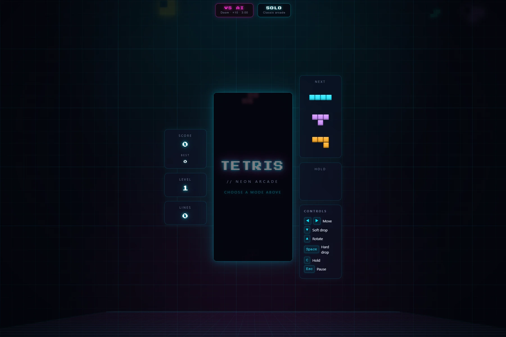

<div align='center'>

  [![demo][demo]][demo-link]
  [![status][status]][status-link]
  [![test][tests]][tests-link]

</div>

<div align='center'>
  <a href='/'>
    
  </a>
</div>

<div align='center'>
  <h1>Tetris Game with JavaScript</h1>
</div>

<div align='center'>

  [![HTML5][html]][html-link]
  [![CSS3][css]][css-link]
  [![JavaScript][javascript]][javascript-link]
  [![Vite][vite]][vite-link]

</div>

<div align='center'>
  Neon arcade Tetris built with vanilla JavaScript and HTML5 Canvas. Play a classic solo run or race a Dellacherie-driven AI in Doom mode — ×10 gravity, a shared piece feed, and a three-minute clock.

  [Demo][demo-link] · [Report issue](/issues) · [Suggest something](/issues)
</div>

## Table of Contents

- [Table of Contents](#table-of-contents)
- [Features](#features)
- [Tech Stack](#tech-stack)
- [Getting Started](#getting-started)
  - [Prerequisites](#prerequisites)
  - [Installation](#installation)
  - [Running locally](#running-locally)
  - [Build](#build)
- [Project Structure](#project-structure)
- [Demo](#demo)
- [Authors](#authors)
- [Contributing](#contributing)
- [License](#license)

## Features

- [x] Two modes — Solo classic arcade and Vs AI "Doom"
- [x] Doom mode runs at ×10 gravity with a shortened lock delay and a 3:00 match clock
- [x] AI opponent driven by the Dellacherie evaluation — landing height, rows eliminated, row/column transitions, holes and cumulative wells
- [x] Both boards are fed the same piece sequence, so a doom match is a fair race
- [x] 7-bag randomizer with a 3-piece next queue
- [x] Hold piece, locked out until the next piece locks (off in doom mode)
- [x] Ghost piece landing indicator
- [x] Wall kicks on rotation, plus a lock delay with capped resets
- [x] DAS/ARR auto-shift while a movement key is held
- [x] Scored hard drop and soft drop
- [x] Combo, back-to-back Tetris and level-scaled line scoring
- [x] Level up every 10 lines, with the best score persisted in localStorage
- [x] Keyboard controls — arrows to move and rotate, Space to hard drop, C to hold, Esc to pause
- [x] Neon arcade UI with CRT scanlines, vignette and a drifting tetromino backdrop
- [x] Particle line clears, screen shake, and slow motion on a Tetris
- [x] Board-clear explosion on game over
- [x] Motion effects respect `prefers-reduced-motion`
- [x] Canvas-based rendering using the HTML5 Canvas API
- [x] Built with Vite for fast development and HMR
- [x] ESLint with Standard style

## Tech Stack

- [HTML5](https://developer.mozilla.org/en-US/docs/Web/HTML)
- [CSS3](https://developer.mozilla.org/en-US/docs/Web/CSS)
- [JavaScript](https://developer.mozilla.org/en-US/docs/Web/JavaScript)
- [Vite](https://vite.dev/)

## Getting Started

### Prerequisites

- Node.js 16+
- npm, yarn, pnpm, or bun

### Installation

```bash
git clone https://github.com/wrujel/tetris-javascript.git
cd tetris-javascript
npm install
```

### Running locally

```bash
npm run dev
```

Open [http://localhost:5173](http://localhost:5173) with your browser to see the result.

### Build

```bash
npm run build
```

## Project Structure

```
/
├── images/
│   └── screenshot.png
├── utils/
│   ├── ai.js
│   ├── canvas.js
│   ├── constants.js
│   ├── effects.js
│   ├── engine.js
│   └── pieces.js
├── index.html
├── main.js
├── style.css
└── package.json
```

## Demo

You can check out the demo:

[![Demo][demo]][demo-link]

## Authors

- [@wrujel](https://github.com/wrujel) — Creator & maintainer

## Contributing

Contributions are welcome! If you have suggestions or find bugs, please open an issue or submit a pull request.

1. Fork the repository
2. Create your feature branch (`git checkout -b feature/amazing-feature`)
3. Commit your changes (`git commit -m 'Add some amazing feature'`)
4. Push to the branch (`git push origin feature/amazing-feature`)
5. Open a Pull Request

## License

This project is not currently licensed.

---

<!-- Badges -->
[html]: https://img.shields.io/badge/HTML5-E34F26?style=for-the-badge&logo=html5&logoColor=white
[css]: https://img.shields.io/badge/CSS3-1572B6?style=for-the-badge&logo=css3&logoColor=white
[javascript]: https://img.shields.io/badge/JavaScript-323330?style=for-the-badge&logo=javascript&logoColor=F7DF1E
[vite]: https://img.shields.io/badge/Vite-646CFF?style=for-the-badge&logo=vite&logoColor=white

<!-- Badge links -->
[html-link]: https://developer.mozilla.org/en-US/docs/Web/HTML
[css-link]: https://developer.mozilla.org/en-US/docs/Web/CSS
[javascript-link]: https://developer.mozilla.org/en-US/docs/Web/JavaScript
[vite-link]: https://vite.dev/

<!-- Status/Demo badges -->
[demo]: https://img.shields.io/badge/🚀%20Live%20Demo-000000?style=for-the-badge&&logoColor=white&color=0a6bdb
[status-link]: https://github.com/wrujel/monitor-repos
[tests-link]: https://github.com/wrujel/monitor-tests

[demo-link]: https://tetris-javascript-pi.vercel.app
[status]: https://img.shields.io/endpoint?url=https%3A%2F%2Fraw.githubusercontent.com%2Fwrujel%2Fmonitor-repos%2Fmain%2Fdata%2Ftetris-javascript.json
[tests]: https://img.shields.io/endpoint?url=https%3A%2F%2Fraw.githubusercontent.com%2Fwrujel%2Fmonitor-tests%2Fmain%2Fdata%2Ftetris-javascript.json
